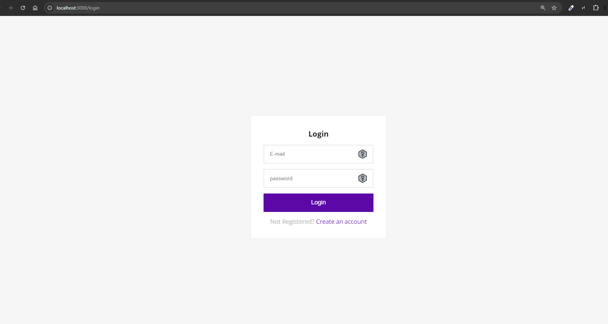
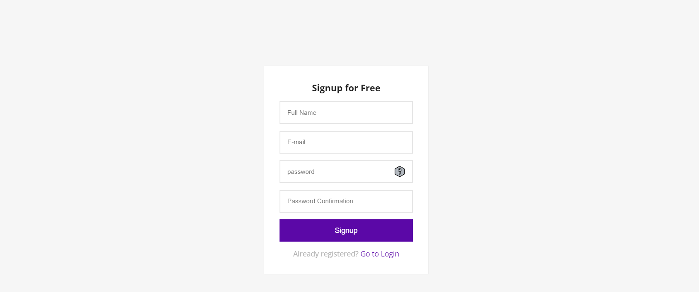
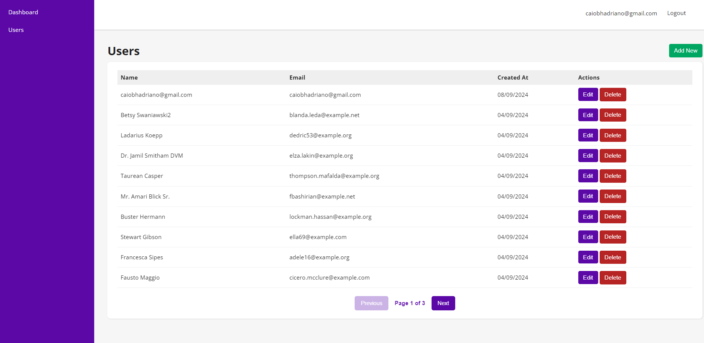
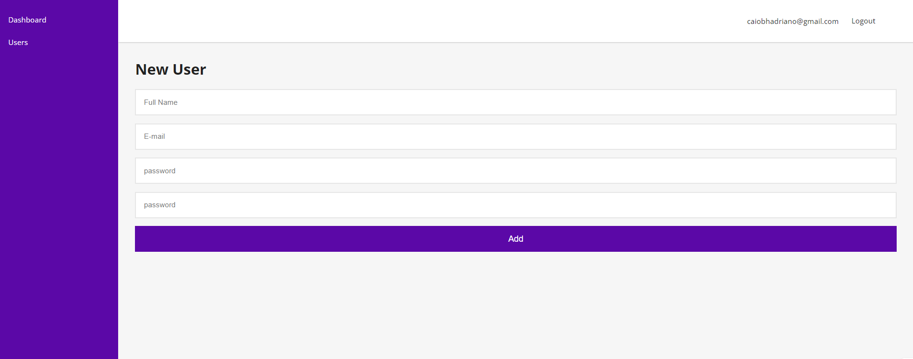
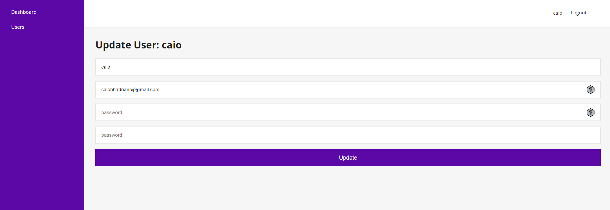

# Dashboard Project

A full-stack application for user management.

## Overview

This project provides a robust platform for managing users, featuring essential CRUD operations, authentication, API integration, and pagination to enhance performance. Built with Laravel and React, this application is scalable, easy to maintain, and Dockerized for seamless deployment.

## Screenshots

-   **Login Page**  
    
-   **Signup Page**  
    
-   **Users List Page (with Pagination)**  
    
-   **User Creation Form**  
    
-   **User Update Form**  
    

## Requirements

To run this project locally, ensure you have the following installed:

-   [**Laravel**](https://laravel.com/)
-   [**Docker**](https://www.docker.com/get-started)
-   [**Node.js**](https://nodejs.org/)
-   **Composer** (for PHP dependencies)

## Features

-   **User Management:** Create, read, update, and delete (CRUD) user records.
-   **Authentication:** Secure login and registration system.
-   **API Integration:** Seamless integration with external APIs.
-   **Pagination:** Efficiently handles large datasets with pagination.

## Technologies

This project is built using the following technologies:

-   **Laravel** - [Official Website](https://laravel.com/)
-   **React** - [Official Website](https://reactjs.org/)
-   **MySQL** - [Official Website](https://www.mysql.com/)
-   **Docker** - [Official Website](https://www.docker.com/)

## Setup Instructions

Follow these steps to set up the project in your local environment:

1. **Clone the repository**:
    ```bash
    git clone git@github.com:ccaioadriano/dashboard-fullstack.git
    cd ./dashboard-fullstack
    ```
2. **Install dependencies on root**:
    ```bash
    composer install
    ```
3. **Install sail end run backend end database containers**:

    ```bash
    composer install
    php artisan sail:install
    ./vendor/bin/sail up -d
    ```

4. **Run database migrations end seeding**:

    ```bash
    ./vendor/bin/sail artisan jwt:secret
    ./vendor/bin/sail artisan migrate
    ./vendor/bin/sail artisan db:seed
    ```

5. **Setup frontend dependencies**:
    ```bash
    cd frontend
    npm install
    npm run dev
    ```

## To-Do List

-   [ ] Add unit tests for backend and frontend
-   [ ] Add unit tests for frontend
-   [ ] Implement caching mechanisms
-   [x] Integrate JWT for API authentication
-   [ ] Add social login functionality (e.g., Google, Facebook)
-   [ ] Improve responsiveness for mobile devices
